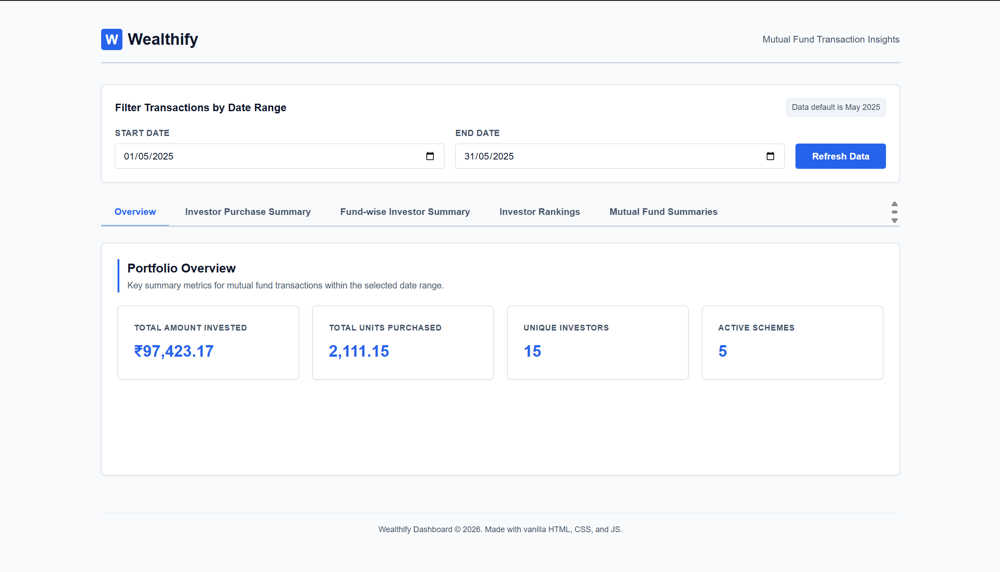
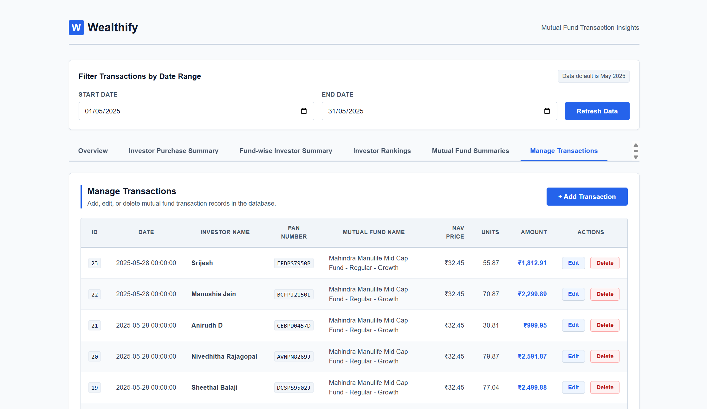
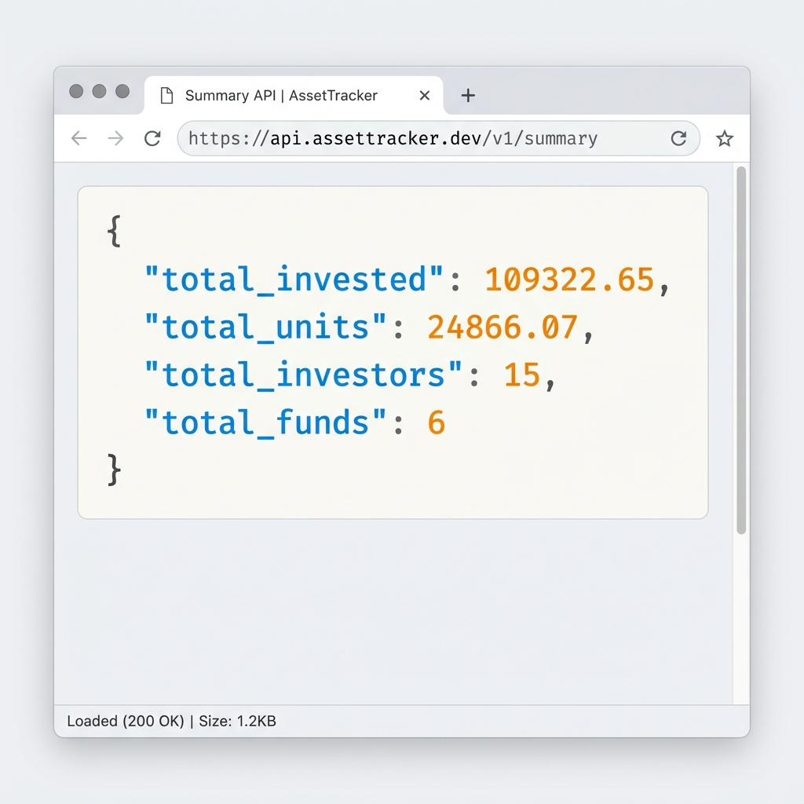

# 💼 Wealthify - Mutual Fund Transaction Dashboard

A lightweight, premium-looking Mutual Fund Transaction Dashboard built with a **FastAPI (Python)** backend, **PostgreSQL** database, and a responsive **Vanilla HTML/CSS/JS** frontend. It enables investors and developers to track portfolio statistics, analyze scheme inflows, and visualize fund performance.

---

## 🔗 Project Links

| Resource | URL |
| :--- | :--- |
| **GitHub Repository** | [https://github.com/jeslinjesuraja/wealthify](https://github.com/jeslinjesuraja/wealthify) |
| **Live Frontend Demo** | [https://wealthify-blush.vercel.app](https://wealthify-blush.vercel.app) |
| **Production Backend** | [https://wealthify-x6qj.onrender.com](https://wealthify-x6qj.onrender.com) |
| **Interactive API Docs (Swagger)** | [https://wealthify-x6qj.onrender.com/docs](https://wealthify-x6qj.onrender.com/docs) |

---

## 🚀 Live Demo

You can interact with the live deployed application at:
👉 **[Wealthify Web Dashboard](https://wealthify-blush.vercel.app)**

*Note: Since the backend is hosted on Render's free tier, the first API request might experience a cold-start delay of 50-60 seconds while the server spins up. If the page shows "Error" at first, please wait a minute and click **Refresh Data**.*

---

## 📷 Screenshots

### 1. Main Dashboard Overview

*Figure 1: The main portfolio dashboard showing high-level summary cards (Total Invested, Total Units, Unique Investors, and Active Schemes) alongside detailed investor rankings and mutual fund summary tables.*

### 2. Transaction Records Management

*Figure 2: The individual transaction logs viewer displaying all transaction records with specific fields including trade date, scheme name, NAV purchase price, units, and action controls.*

### 3. FastAPI Interactive API Documentation (Swagger UI)

*Figure 3: Interactive Swagger UI exposing modular, structured REST API endpoints under `/api` for overview metrics, investor lists, scheme summaries, and transaction logging.*

### 4. Real API Response (JSON format)

*Figure 4: A raw JSON payload response returned by the `/api/overview` endpoint, showcasing precise data formatting and fast retrieval speeds from the database.*

---

## 📌 Project Description

This project provides a clean, fully database-driven financial dashboard. It is structured as a decoupled full-stack application:
- **Frontend:** Pure HTML5 semantic structure, modern Vanilla CSS styling (using slate-blue themes, custom tab controls, and loading spinners), and Vanilla JavaScript utilizing clean `fetch` requests.
- **Backend:** A fast Python FastAPI server utilizing modular `APIRouter` instances to expose transaction metrics, connected securely to a PostgreSQL database.

---

## ✅ Requirements Met

### 📊 Reports & Aggregations
- **Investor-wise Purchase Summary per Mutual Fund:** Aggregates purchase values and unit counts per investor PAN.
- **Mutual Fund-wise Summary per Investor:** Summarizes individual investor holdings across specific schemes.
- **Investor Rankings:** Ranks active investors by total capital invested within the filtered date range.
- **Mutual Fund Summaries:** Calculates total scheme inflows, total volumes, and weighted average NAV prices (`Total Invested / Total Units`).

---

## 🛠️ Prerequisites & Local Setup

### System Requirements
- Python 3.8+
- PostgreSQL Server (with credentials matching your config)

### Installation & Launch

1. **Clone the repository:**
   ```bash
   git clone https://github.com/jeslinjesuraja/wealthify.git
   cd wealthify/backend
   ```

2. **Configure Environment Variables:**
   Create a `.env` file inside the `backend/` directory:
   ```env
   DATABASE_URL=postgresql://[username]:[password]@[host]:[port]/[dbname]
   ```

3. **Install Dependencies:**
   ```bash
   pip install -r requirements.txt
   ```

4. **Initialize & Seed Database:**
   ```bash
   python app/import_csv.py
   ```

5. **Start Uvicorn Server:**
   ```bash
   python -m uvicorn app.main:app --reload
   ```
   The backend API will run locally at `http://127.0.0.1:8000`.

---

## 🔍 Deployment Troubleshooting Report: Vercel to Render Integration

### 1. Root Cause Analysis (Why Localhost Works but Vercel Fails)
The deployed frontend on Vercel is failing to load database metrics because of the dynamic API URL resolution logic configured in `frontend/script.js`:
- **On Localhost:** `window.location.hostname` is `'localhost'` or `'127.0.0.1'`, which evaluates to the local backend address `http://127.0.0.1:8000/api`. This successfully routes API calls to the local FastAPI server.
- **On Vercel:** `window.location.hostname` is `'wealthify-blush.vercel.app'`. Since this does not match local hostnames, it resolves to `window.location.origin + '/api'` (`https://wealthify-blush.vercel.app/api`).
- **The Problem:** Vercel only hosts static frontend files for this project; it does not run the Python FastAPI backend. Directing API calls to Vercel's domain results in **404 Not Found** errors for all data requests.

### 2. CORS Policy Verification
- **Frontend Domain:** `https://wealthify-blush.vercel.app`
- **Backend Domain:** `https://wealthify-x6qj.onrender.com`
- **CORS Status:** The backend's CORS middleware is configured correctly in `backend/app/main.py` using `allow_origins=["*"]`. This permits the Vercel frontend to query the Render API directly without being blocked by cross-origin security policies.

### 3. Render Cold Start Behavior
Render's free-tier instances automatically spin down (hibernate) after 15 minutes of inactivity. When visiting the Vercel frontend for the first time in a while:
- The initial request triggers a container spin-up on Render, causing a **50–60 second delay**.
- If the frontend requests time out before Render finishes waking up, the dashboard will show a temporary `"Error"` state.
- Once the Render backend is warm, clicking **Refresh Data** or reloading the page immediately pulls the data from Neon PostgreSQL.

### 4. Required Code Fix
To resolve the Vercel deployment error, update the frontend's API URL configuration in `frontend/script.js` to point directly to the live Render backend URL when not running in local development mode.

#### **File Name:**
`frontend/script.js` (Lines 5-7)

#### **Current Code:**
```javascript
const API_BASE_URL = window.location.hostname === '' || window.location.hostname === 'localhost' || window.location.hostname === '127.0.0.1'
    ? 'http://127.0.0.1:8000/api'
    : window.location.origin + '/api';
```

#### **Updated Code:**
```javascript
const API_BASE_URL = window.location.hostname === '' || window.location.hostname === 'localhost' || window.location.hostname === '127.0.0.1'
    ? 'http://127.0.0.1:8000/api'
    : 'https://wealthify-x6qj.onrender.com/api';
```
*(This ensures that local development still routes to localhost:8000, while production builds correctly route to the Render server).*
