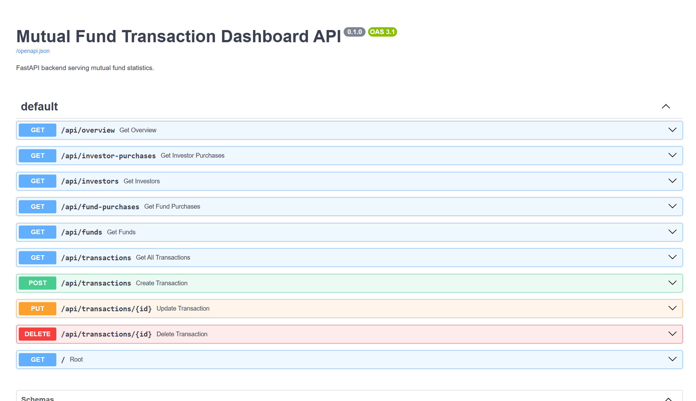

# 💼 Wealthify - Mutual Fund Transaction Dashboard

## Project Links

Frontend =https://jeslinjesuraja.github.io/Wealthify_task_frontend/  
Backend = https://github.com/jeslinjesuraja/wealthify_backend  

Dashboard Screenshot=https://drive.google.com/drive/folders/1sacZG_RcsYdsmLqPGvK1LCxgWhDqHyUL?usp=sharing

### 📷 Application Screenshots

#### Interactive Mutual Fund Dashboard (With CRUD Actions)


#### FastAPI Swagger API Documentation


---

## 📌 Project Description

A full-stack web application designed to summarize mutual fund transaction activity within a selected date range.

This project consists of:

Frontend: A pure HTML/CSS/Vanilla JavaScript application with a simple, clean UI.  
Backend: A FastAPI Python backend connecting to a PostgreSQL database.

---

## ✅ Requirements Met

### 📊 Investor-wise Purchase Summary per Mutual Fund
- Total purchase amount per mutual fund  
- Total NAV units purchased per mutual fund  
- Filterable by selected date range  

---

### 📈 Mutual Fund-wise Summary per Investor
- Amount and NAV units purchased by each investor for each mutual fund  
- Filterable by selected date range  

---

### 👤 Investor List with Purchase Details
- Investor PAN number  
- Total amount invested within the selected date range  

---

### 💰 Mutual Fund Summary
- Total amount invested across all investors  
- Total NAV units purchased  
- Average NAV price per mutual fund  

---

## 🛠️ Prerequisites and Tools Required

To run this project locally, ensure you have:

- Python 3.8+
- pip (Python package manager)
- PostgreSQL Database
- A modern browser (Chrome / Edge / Firefox)

---

## ⚙️ How to Setup

### Backend Setup

Open terminal and navigate to backend folder:
```bash id="setup1"
cd backend